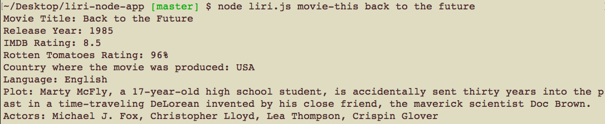
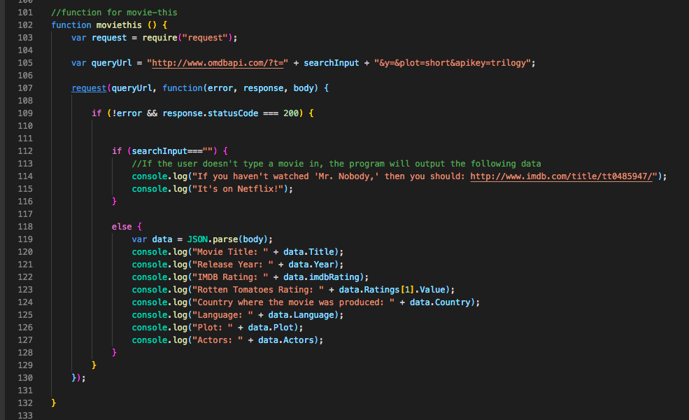

# liri-node-app
Assignment_LIRI Bot

# Link to deployed site
https://lalatw.github.io/liri-node-app/


# Images


# Technology used
* javascript
* node.js
* Node-Spotify-API
* Request
* OMDB API
* Bands In Town API
* Moment
* DotEnv


# npm Install
```
 "dependencies": {
    "dotenv": "^6.0.0",
    "moment": "^2.22.2",
    "node-spotify-api": "^1.0.7",
    "request": "^2.88.0"
  }
```

# Code snippets



# Learning points
* Apply Node.js to run backend and executes JavaScript code outside of a browser. 
* Run npm install to use pre-built packages of modules.
* Use Request to grab data from various API.
* Use moment to convert date related data format and display.
* Apply fs to read file.
* Adopt Node-Spotify-API
* Adopt OMDB API
* Adopt Bands In Town API


# Author 
[Shuhan Laura Lee](https://lalatw.github.io/liri-node-app/)


# License
Standard MIT License
